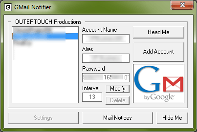



## GMail / Google Mail Notifier \- Checker 1\.0\.3

### Description

Supports unlimited accounts. Notifies you when you receive new emails through gmail.___-Can preview emails within application.___-Tray icon that changes, as well as tooltip.___-Light password encryption for local storage.___-HEAVILY commented___-

I was inspired to create this program after having other programs randomly 'forget' settings, and after noticing there is no decent easy to use version already on pscode.

Feel free to leave any suggestions or comments.
 
### More Info
 

             |
---                |---
**Submitted On**   |2010-02-27 23:24:18
**By**             |[Benjamin Berwick](https://github.com/Planet-Source-Code/PSCIndex/blob/master/ByAuthor/benjamin-berwick.md)
**Level**          |Intermediate
**User Rating**    |4.3 (13 globes from 3 users)
**Compatibility**  |VB 6\.0
**Category**       |[Internet/ HTML](https://github.com/Planet-Source-Code/PSCIndex/blob/master/ByCategory/internet-html__1-34.md)
**World**          |[Visual Basic](https://github.com/Planet-Source-Code/PSCIndex/blob/master/ByWorld/visual-basic.md)
**Archive File**   |[GMail\_\_\_Go2175942272010\.zip](https://github.com/Planet-Source-Code/benjamin-berwick-gmail-google-mail-notifier-checker-1-0-3__1-72741/archive/master.zip)

